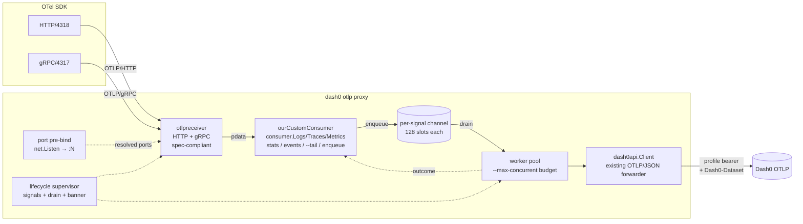

# feat: `dash0 otlp proxy` — local-dev OTLP forwarder

## Summary

Add a new `-X`-gated long-running command `dash0 otlp proxy` that wraps the OTel Collector's `otlpreceiver` in a thin CLI shell to expose OTLP/HTTP (4318) and OTLP/gRPC (4317) locally, then forwards inbound pdata into Dash0 via the existing `dash0-api-client-go` HTTP/JSON client.
The proxy is the first daemon-shaped command in the CLI; signal handling, in-place stderr redraw with sparklines, and a daemon-roundtrip test harness are all new patterns introduced by this work.
The wire-protocol heavy lifting (HTTP routing, gRPC services, content-type negotiation, gzip, message-size limits, partial-success responses) is delegated to `otlpreceiver` so the proxy inherits the same spec-compliant SDK compatibility the Collector enjoys.

---

## Problem Frame

Local-dev OTel onboarding today requires running an OpenTelemetry Collector with bearer-token YAML (~25 lines, four concepts) or skipping Dash0 in dev altogether.
The CLI explicitly does not aim to replace the Collector (`STRATEGY.md` non-goal), but it can collapse the local-dev case: a developer wants `dash0 otlp proxy` in one terminal and an OTel-instrumented app in another, with no config files anywhere.
See `docs/brainstorms/2026-06-11-otlp-proxy-local-dev-requirements.md` for the full motivation, prior-art survey, and product framing.

---

## Origin Traceability

This plan is sourced from `docs/brainstorms/2026-06-11-otlp-proxy-local-dev-requirements.md` (the proxy brief).
Every brainstorm decision (KD1-KD9), requirement (R1-R12 plus R6a), acceptance example (AE1-AE6), actor (A1-A4), and key flow (F1-F2) is carried forward; new acceptance examples (AE7-AE17) extend the brief based on flow analysis surfaced during planning research.
Strategy alignment: lives in the "Non-IaC workflows" track per `STRATEGY.md`; explicit Collector-replacement non-goal preserved across this plan — embedding the Collector's `otlpreceiver` is *using* a Collector primitive, not replacing the Collector. The proxy bundles a hard-coded slice of Collector machinery (receiver only, no batchprocessor, no exporter) for one specific local-dev use case; users who need general OTLP processing still reach for the Collector.

---

## Requirements

| ID | Requirement | Lands in |
|----|-------------|----------|
| R1 | Gated behind `-X` (`--experimental`) initially | U1 |
| R2 | Resolves `otlp-url`, `auth-token`, `dataset` from env > flag > profile | U1, U4 |
| R3 | Per-signal rate + total live-stats — stderr (TTY) or stdout NDJSON-OTLP/JSON (agent) | U6, U7, U8 |
| R4 | SIGINT/SIGTERM exit clean with ~5s drain | U5 |
| R5 | Prints active profile + dataset on start | U1, U5 |
| R6 | Async-forward per OTLP spec; backpressure as 503+Retry-After on queue saturation; no disk buffer | U4, U13 |
| R6a | `--tail` prints forwarded records in collector-debug-exporter style on stdout | U9 |
| R7 | Dual listeners (4318 HTTP, 4317 gRPC) with independent OS-assigned fallback; `--http-port`, `--grpc-port`, env-var overrides | U1, U12 |
| R8 | HTTP exposes `/v1/logs|traces|metrics`; gRPC exposes the three OTLP services | U12 (inherited from `otlpreceiver`) |
| R9 | Accepts `application/x-protobuf` and `application/json` (HTTP); standard OTLP/gRPC framing (gRPC) | U12 (inherited from `otlpreceiver`) |
| R10 | Strips inbound `Authorization` + gRPC `authorization` metadata; injects profile bearer outbound; ignores routing-style headers | U4, U12 |
| R11 | Start banner lists actual endpoint per listener; fallback prints export-line hint | U5 |
| R12 | gRPC ingest is first-class in v1; transcodes inbound gRPC to outbound HTTP/JSON via pdata | U12, U13, U4 |

---

## Key Technical Decisions

**KTD1. Package home is `internal/otlp/`, extending existing utilities.**
The brief commits the package home in its Dependencies section; this plan locks the internal file split (`proxy.go`, `proxy_pipeline.go`, `proxy_consumer.go`, `proxy_workers.go`, `proxy_lifecycle.go`, `proxy_stats.go`, `proxy_tail.go`, `proxy_events.go`, plus `otlp_cmd.go` for the cobra parent).
No new `internal/otlpproxy/` and no shared `internal/ingest/` abstraction.
Rationale: the brief's Dependencies bullet plus `docs/project-structure.md`'s "shared OTLP utilities live in `internal/otlp/`" rule.

**KTD2. Reuse `otlpreceiver` for the inbound listener stack; keep `dash0api.Client` for the outbound side.**
The proxy embeds `go.opentelemetry.io/collector/receiver/otlpreceiver` to expose the OTLP/HTTP and OTLP/gRPC endpoints. The receiver hands decoded pdata to our custom `consumer.Logs` / `consumer.Traces` / `consumer.Metrics` implementations; from there we queue and forward outbound via the existing `dash0-api-client-go.SendLogs` / `SendTraces` / `SendMetrics`.
Rationale: SDK exporter behavior has many edge cases (gzip negotiation, content-type, partial-success, content-length, gRPC keepalives, max-message-size, proto version skew, etc.); `otlpreceiver` is battle-tested against every published OTel SDK. Rolling our own listener stack would discover those edges one bug report at a time.
The outbound side keeps `dash0-api-client-go` (not `otlphttpexporter`) because the existing client already encodes Dash0-specific retry semantics, the `--max-retries` plumbing, and the `Dash0-Dataset` header convention — replacing it would force us to re-implement those behaviors inside an exporter wrapper for no compatibility gain.

**KTD2a. No batchprocessor — direct pass-through receiver → consumer → workers → upstream.**
The proxy does not include the Collector's `batchprocessor`. Each inbound OTLP request flows: receiver delivers pdata → our consumer enqueues to a per-signal channel → worker goroutine pulls from the channel and calls `dash0api.Client.SendX` with the un-batched pdata.
Rationale: batching trades latency for throughput; in local dev the trade is wrong (the user is debugging a single app and wants to see telemetry land in seconds, not after a batch window). Skipping the processor also removes an entire class of "where did my data go" failure modes that the Collector's batch processor introduces (silent drops on overflow, async logging of export errors). The pdata batches inbound from the SDK already aggregate the SDK's emissions; re-batching adds nothing.

**KTD3a. Async-forward per OTLP spec; backpressure as 503 + Retry-After.**
The OTLP spec scopes reliability to single hops: HTTP 200 means "accepted at this node," not "delivered to upstream" ([OTLP spec §5](https://opentelemetry.io/docs/specs/otlp/)). Our consumer returns `nil` after pdata enters the per-signal queue (the receiver maps `nil` to HTTP 200 / gRPC OK), matching the OTel Collector's `otlpreceiver` → consumer-chain boundary exactly. Upstream forward happens asynchronously on worker goroutines; failures flow to stats (U6) and agent-mode error events (U8), not to the SDK that already received its 200.
When the per-signal queue is at capacity (128), the consumer returns a non-permanent error (`consumer.Error` with retryable semantics); the receiver maps that to HTTP 503 / gRPC `UNAVAILABLE` so the SDK's mandated exponential backoff applies. No data is silently dropped — saturation is explicit and observable. This is strictly more reliable than the OTel Collector's default `block_on_overflow=false` exporter-queue behavior, which drops on overflow without notification.
Rationale: sync-forward (block consumer until upstream returns) would make the proxy a latency multiplier — every SDK export call pays the full Dash0 round-trip — which is worse than pointing the SDK directly at Dash0. Async-forward is the only model that preserves the proxy's local-dev value proposition without violating OTLP spec.

**KTD3b. Long-lived outbound client; one instance per process; concurrency configurable.**
`client.NewOtlpClientFromContext` is called once at proxy start and the returned `dash0api.Client` is reused for every forwarded request, with `dash0.WithMaxConcurrentRequests(flags.MaxConcurrent)` passed at construction (default 10, configurable via `--max-concurrent` / `DASH0_OTLP_PROXY_MAX_CONCURRENT`).
The client's single shared semaphore caps total in-flight outbound across all three signals. Per-signal queue depth is 128 to give the 10-concurrent transport headroom under bursty SDK output.
Worker count per signal is bounded by the concurrency budget — workers contend for the same semaphore inside the client.
Rationale: existing one-shot sends use the client per-invocation, but the proxy's forwarding rate makes that wasteful. The configurable concurrency lets users tune down for low-resource laptops or up when the client's max-10 limit lifts.

**KTD4. `otlpreceiver` runs both HTTP and gRPC listeners; we pre-bind ports to control fallback.**
`otlpreceiver` does not implement OS-assigned-port fallback on its own — its config takes explicit endpoint strings. We resolve port collisions ourselves: `net.Listen("tcp", "127.0.0.1:<default>")` to detect collision, fall back to `:0` for OS-assigned on default-port collision (KTD5 semantics), capture the resolved `:N`, then build the receiver Config with the resolved `127.0.0.1:N` strings before starting it.
A failure to bind one listener (explicit override + collision) does not stop the other from starting — we attempt both independently before constructing the Config, and the Config only includes endpoints that successfully bound.
Rationale: pre-binding is the cleanest way to give the receiver a port it cannot fail to bind on, while preserving the brief's per-listener-independent fallback semantics (R7, AE3-AE6).

**KTD5. Exit code semantics: any explicit-override collision is non-zero; total bind failure is non-zero; partial fallback is zero.**
- Both default ports work or fall back to OS-assigned → exit zero on Ctrl-C.
- One listener succeeds (default or fallback), the other fails because the user explicitly overrode the port and the override collides → the proxy keeps running with one listener, but exits non-zero on shutdown so CI scripts can detect the partial-success state.
- Both listeners fail (e.g., explicit overrides collide on both) → proxy exits non-zero immediately at startup without constructing the receiver Config.
Rationale: explicit overrides are user intent; silently rebinding violates that intent. Fallback-on-default is convenience, not intent.

**KTD6. Same-port flag validation at parse time.**
`--http-port <N> --grpc-port <N>` (same port for both listeners) is rejected at flag-validation time (after env-var binding, before any bind attempt) with a clear error: "HTTP and gRPC listeners cannot share a port."
Rationale: OTLP/HTTP and OTLP/gRPC use incompatible framing; a single TCP port cannot host both.

**KTD7. Credential broker via receiver config + outbound client config; no per-request header manipulation.**
The `otlpreceiver` is configured with no inbound authentication required (`Auth: nil` in the receiver's gRPC and HTTP config blocks) so any `Authorization` header or gRPC `authorization` metadata an SDK sends is accepted but never inspected — the receiver discards it before our consumer ever sees the request. The outbound side gets the bearer from the active profile via `dash0api.Client` construction (`dash0.WithAuthToken(profile.AuthToken)`).
Rationale: precedent in `internal/rawapi/request.go:87-89` (auth header is CLI-managed); using the receiver's built-in auth-disabled config is structurally cleaner than writing per-request strip-list code, and it correctly handles every inbound header shape (Authorization, Proxy-Authorization, etc.) without enumerating them.

**KTD8. Stats interval default: 1 second; overridable via `--stats-interval <dur>`.**
The per-interval ticker fires every 1s, emitting both the TTY stats-line redraw and the agent-mode NDJSON stats event.
Rationale: KD7 of the brief targets "is it flowing?" anxiety; 1s feels immediate. 5s is too laggy when a developer just plugged in their app and is watching. The flag override is cheap insurance.

**KTD9. `--tail` detail level: "detailed" by default; no per-record status marker.**
v1 always renders inbound records in the OTel Collector debug exporter's `detailed` style (resource attributes, scope, full per-record fields), printed at consumer entry (pre-queue). The earlier "`[OK]/[FAIL]`" status-marker design is dropped — it doesn't fit the async-forward model and the Collector debug exporter doesn't annotate per-record outcomes either.
Upstream success/failure is observable separately via stats counters (TTY) and agent-mode error events (stdout).
Adding `--tail-detail basic|normal|detailed` (or `-v / -vv / -vvv`) is deferred to follow-up work.
Rationale: detailed is the FUD-killer; v1 ships one good default rather than three half-baked levels.

**KTD11. Stream routing under all mode combinations is uniform.**

| Stream | TTY mode (no agent) | Agent mode (`DASH0_AGENT_MODE=true`) |
|--------|---------------------|--------------------------------------|
| Per-signal stats | Live-update on **stderr** (sparklines when wide enough) | Append on **stdout** as NDJSON-OTLP/JSON `dash0.cli.otlp_proxy.stats` events |
| Lifecycle events (start, fallback, error, shutdown) | One-shot lines on **stderr** | Append on **stdout** as NDJSON-OTLP/JSON `dash0.cli.otlp_proxy.<event>` records |
| `--tail` (forwarded records) | **stdout** (pipeable to `grep`/`jq`) | Suppressed by default; `--tail-stderr` reroutes to **stderr** |
| `--tail` + agent mode without `--tail-stderr` | Hard error at startup | Hard error at startup |

**KTD12. Stdout writer is single-goroutine, single-writer, flush-per-event.**
A `stdoutWriter` goroutine owns `os.Stdout`. All event emissions (`forwarded`, `stats`, `error`, `lifecycle`, `--tail` records) push to a buffered channel; the goroutine serializes encoding (`json.Encoder.Encode` + explicit `bufio.Writer.Flush` per event) so consumers reading line-by-line never see partial JSON.
Rationale: KD8 of the brief mandates one valid OTLP/JSON record per line; concurrent writes from receiver / consumer / worker / stats / lifecycle goroutines would corrupt without serialization.

**KTD13. Stderr writer is single-goroutine, redraw-aware.**
A `stderrWriter` goroutine owns `os.Stderr`. The live-stats line is held in the goroutine's local state; when a lifecycle event arrives via channel, the goroutine clears the stats line (`\r` + space-pad), writes the event with a newline, and redraws the stats line below.
Terminal-width refresh is platform-split: on Unix, a `SIGWINCH` handler (`signal.Notify(ch, syscall.SIGWINCH)`) re-snapshots width via `golang.org/x/term.GetSize`; on Windows, a periodic poll fills the same role (`syscall.SIGWINCH` does not compile on Windows). Files: `proxy_stderr_writer_unix.go` (`//go:build !windows`) and `proxy_stderr_writer_windows.go` (`//go:build windows`). The Windows path is being addressed in a separate session — the file split is in place now, the body of the Windows file lands later.
Rationale: KD7's "lifecycle events render above the live-updating stats area" requires explicit serialization; ad-hoc writes from multiple goroutines would interleave.

**KTD14. Error categorization for the `dash0.cli.otlp_proxy.error` event.**
The `error.kind` attribute is one of: `upstream_unreachable`, `upstream_5xx`, `upstream_4xx_auth`, `upstream_4xx_other`, `internal_panic`. Decoding failures and signal-mismatch errors no longer appear — `otlpreceiver` handles those at its own boundary with the correct HTTP/gRPC status codes before our code sees the request.
The `upstream_4xx_auth` case (Dash0 returns 401/403) gets a distinctive stderr line ("authentication to Dash0 failed; check your profile") because every subsequent forward will also fail.
Rationale: the SDK's retry logic should differentiate transient (5xx) from terminal (auth); agents reading the event stream need the same signal.

**KTD15. UUID for `service.instance.id` generated once at process start.**
Use `github.com/google/uuid.NewString()` (currently indirect; promoting to direct).
The same UUID is included on every NDJSON event so consumers can group by process across the event stream. `service.instance.id` is per-process-invocation — a sequence of proxy runs in one CI session emits distinct IDs.

---

## Alternatives Considered

**A1. Roll our own HTTP and gRPC listeners.**
Originally proposed in earlier drafts of this plan (separate `proxy_listener_http.go` and `proxy_listener_grpc.go` files). Rejected mid-planning: SDK exporter compatibility has too many edge cases (gzip negotiation, content-type, partial-success, content-length, gRPC keepalives, max-message-size, proto version skew, etc.) and the OTel Collector's `otlpreceiver` already handles all of them spec-compliantly. The maintenance cost of catching up to receiver-quality compatibility would be larger than the dependency cost of importing it.

**A2. Embed the full Collector pipeline (`otlpreceiver` + `batchprocessor` + `otlphttpexporter`).**
Considered. Rejected: the batchprocessor adds latency that fights the local-dev "is it flowing?" UX, and its default queue behavior (drop on overflow without notification) is exactly the silent-loss failure mode we want to avoid. The `otlphttpexporter` would also force us off `dash0-api-client-go`, losing our existing retry / concurrency / dataset-header conventions. KTD2a captures the no-batch decision.

**A3. proto-direct (no pdata) for gRPC inbound.**
Rejected when KTD2 settled on `otlpreceiver`: the receiver hands us pdata directly, so proto-level handling is hidden behind the receiver's API.

**A4. Disk-buffer outbound during outages.**
Rejected: explicit non-goal per `STRATEGY.md` ("not replacing the Collector"). KD3 of the brief locks fail-loud as the v1 posture, refined here as 503+Retry-After on queue saturation.

**A5. SDK-style retry inside the proxy beyond `--max-retries`.**
Rejected: `dash0-api-client-go` already implements retry with backoff via `WithMaxRetries`. Layering another retry on top is duplication and would push p99 latency through the roof on a flaky upstream.

---

## High-Level Technical Design

### Component diagram



### Listener lifecycle (per port, before receiver construction)

```mermaid
stateDiagram-v2
    [*] --> AttemptDefault
    AttemptDefault --> Bound: default port free (net.Listen succeeded)
    AttemptDefault --> AttemptFallback: default in use (no explicit override)
    AttemptDefault --> Failed: explicit override + collision
    AttemptFallback --> Bound: OS-assigned port found (net.Listen ":0")
    AttemptFallback --> Failed: no free port (rare)
    Bound --> ReceiverConfig: port included in receiver Config
    Failed --> SkipListener: skipped; other listener still attempted
    ReceiverConfig --> Serving: receiver.Start succeeded
    Serving --> Draining: shutdown signal
    Draining --> [*]: receiver.Shutdown returns or 5s deadline
```



### Stream routing matrix (TTY + agent + `--tail` combinations)

| TTY? | Agent? | `--tail` set? | stderr content | stdout content |
|------|--------|---------------|----------------|----------------|
| yes | no | no | banner + stats line (sparkline) + lifecycle | empty |
| yes | no | yes | banner + stats line + lifecycle | per-record debug-style render |
| yes | yes | no | banner only | NDJSON events + stats |
| yes | yes | yes | banner + per-record debug-style render (because `--tail-stderr` required) | NDJSON events + stats |
| no | no | no | banner + stats (no sparkline, text-only) + lifecycle | empty |
| no | yes | * | banner | NDJSON events + stats (+ debug-style if `--tail-stderr`) |

(Where "yes" in agent + `--tail` without `--tail-stderr` is rejected at startup with a hard error per KTD11.)

---

## Output Structure

New files under `internal/otlp/`:

```text
internal/otlp/
├── otlp_cmd.go                  # NewOtlpCmd() parent cobra group
├── proxy.go                     # newProxyCmd() + runProxy() entrypoint
├── proxy_pipeline.go            # port pre-bind + otlpreceiver assembly + consumer wiring
├── proxy_consumer.go            # consumer.Logs/Traces/Metrics implementation
├── proxy_workers.go             # worker pool + dash0api.Client outbound; error.kind classification
├── proxy_lifecycle.go           # supervisor: signals, drain, banner, exit codes
├── proxy_stats.go               # per-signal counters + ticker + rate snapshot
├── proxy_sparkline.go           # Unicode block timeline rendering
├── proxy_events.go              # NDJSON-OTLP/JSON event emitter
├── proxy_stdout_writer.go       # single-writer goroutine owning os.Stdout (NDJSON + --tail in TTY)
├── proxy_stderr_writer.go       # single-writer goroutine owning os.Stderr (stats + lifecycle)
├── proxy_stderr_writer_unix.go     # //go:build !windows; SIGWINCH terminal-width refresh
├── proxy_stderr_writer_windows.go  # //go:build windows; periodic width-poll fallback
├── proxy_tail.go                # collector-debug-exporter-style per-record render
└── proxy_integration_test.go    # //go:build integration; mock-server harness
```

New files under `test/roundtrip/`:

```text
test/roundtrip/
├── lib/
│   └── daemon.sh                # shared daemon-roundtrip helpers (start, ready, kill)
├── test_otlp_proxy_logs_roundtrip.sh
├── test_otlp_proxy_spans_roundtrip.sh
└── test_otlp_proxy_metrics_roundtrip.sh
```

Modified files:

```text
cmd/dash0/main.go                # register otlp.NewOtlpCmd() in init()
test/roundtrip/run_all.sh        # add the three new roundtrip scripts to OTLP_TESTS
docs/commands.md                 # add "OTLP proxy" section
README.md                        # add a section if user-facing functionality warrants
docs/code-style.md               # update [Direct production dependencies] table
.chloggen/<branch>.yaml          # changelog entry (new_component)
go.mod / go.sum                  # add otlpreceiver + Collector core deps transitively
```

---

## Scope Boundaries

### In scope (v1)

- `dash0 otlp proxy` daemon embedding `otlpreceiver` for inbound (HTTP/4318 + gRPC/4317) with independent port pre-bind + fallback.
- Custom consumer + per-signal queue (depth 128) + worker pool (`--max-concurrent` budget, default 10) draining via the existing `dash0api.Client`.
- No batchprocessor; one inbound batch = one outbound batch.
- Async-forward per OTLP spec (KTD3a); queue-saturation 503+Retry-After.
- Credential brokering via receiver auth-disabled config + outbound client construction (KTD7).
- Per-signal live counters (rate + total for logs / spans / metrics) with Unicode timeline sparklines on stderr (TTY); NDJSON-OTLP/JSON stats events in agent mode.
- `--tail` collector-debug-exporter-style per-record rendering at consumer entry (no status marker).
- Same-port collision validation; explicit-override fail-loud semantics.
- Graceful drain on SIGINT/SIGTERM (~5s).
- In-process integration tests via mock server; daemon-roundtrip scripts for all three signals.
- Documentation in `docs/commands.md`, `README.md`, and a changelog entry.

### Deferred to Follow-Up Work

- `--tail-detail basic|normal|detailed` verbosity levels (KTD9 — v1 ships detailed only).
- Adaptive stats interval (faster early, slower at steady state). v1 ships fixed `--stats-interval`.
- Durable disk-backed buffering on outage (revisit only if customer pain emerges; small in-memory ring buffer is the cheaper upgrade if needed).
- `dash0 exec -- <cmd>` subprocess wrapper.
- OAuth-on-first-run for users without an active profile (composes with `feat/oauth-login` separately).
- Promotion to stable (`-X` graduation per `docs/promoting-commands-to-stable.md`).
- `docs/command-patterns.md` "Daemon commands" section (writeup once the shape stabilizes).
- `dash0 logs send --tail` / `dash0 spans send --tail` — separate brief, separate plan; out of scope for this plan.

### Outside this product's identity

- Replacing the OpenTelemetry Collector (`STRATEGY.md` non-goal). Embedding `otlpreceiver` for one hard-coded pipeline is *using* a Collector primitive, not replacing the Collector.
- Per-request dataset routing (multi-tenant proxy). One instance proxies one profile, permanently (KD5).
- TUI or local-inspection UI (`STRATEGY.md` non-goal).
- User-configurable processor/exporter chains (would re-create the Collector's surface).
- Non-OTLP wire formats (Zipkin, Jaeger, statsd) — Collector territory.
- Pointing the proxy at non-Dash0 OTLP backends. The active profile's `otlp-url` is the only outbound target.
- A `dash0 dev` umbrella for local-dev commands.

---

## Risks and Dependencies

### Risks

**Risk R1 — Collector dep tree footprint.**
Importing `otlpreceiver` pulls in roughly 15-20 Collector core modules (`receiver`, `consumer`, `component`, `config/{confighttp,configgrpc,confignet,configauth,configtls,configopaque,configcompression}`, `extension`, `extension/auth`, `receiver/receiverhelper`, plus their transitive friends). The CLI binary grows from ~30 MB to ~70-80 MB.
Mitigation: pin versions in `go.mod` explicitly; verify binary size delta is acceptable for Homebrew distribution; document in `docs/code-style.md` dependency table.

**Risk R2 — Daemon-roundtrip test pattern fragility.**
The new `test/roundtrip/lib/daemon.sh` is the first time a roundtrip script backgrounds a long-running process. CI flakiness around port allocation, race between "proxy ready" and "test sends" is a real risk.
Mitigation: use OS-assigned ports in tests (not hardcoded 4318/4317 to avoid CI port contention); poll start banner on stderr to capture actual port; readiness probe with bounded retry before sending. Escape hatch: if the pattern proves flaky, the in-process integration tests (`proxy_integration_test.go`) become the canonical CI coverage and the daemon-roundtrip scripts remain developer-runnable only.

**Risk R3 — TTY sparkline edge cases on uncommon terminals.**
Windows terminals, screen multiplexers (tmux, screen), and IDE-embedded terminals have inconsistent Unicode and width-reporting behavior.
Mitigation: text-only fallback path always works; sparkline is opportunistic, never load-bearing for correctness.

**Risk R4 — Concurrent stdout/stderr writes from multiple goroutines.**
Without explicit serialization, receiver / consumer / worker / stats / lifecycle goroutines could interleave on stdout/stderr.
Mitigation: KTD12 + KTD13 — single `stdoutWriter` and `stderrWriter` goroutines own their respective streams; all other writers push via channel.

**Risk R5 — Collector module version churn.**
Collector releases roughly every two weeks; tracking receiver-API changes across versions adds maintenance load.
Mitigation: pin a known-good Collector version in `go.mod`; bump deliberately with verification rather than chasing latest; the receiver API is one of the more stable Collector interfaces, so churn impact is mostly transitive.

**Risk R6 — Outbound concurrency cap + retry budget blocking workers.**
`dash0-api-client-go.WithMaxConcurrentRequests` defaults to 3 (max 10). `WithMaxRetries(3)` plus exponential backoff can push a single outbound request past 10s.
Mitigation: (a) raise concurrency to the client's max via `dash0.WithMaxConcurrentRequests(10)` at proxy start, expose `--max-concurrent <N>` (with `DASH0_OTLP_PROXY_MAX_CONCURRENT` env var) for tuning; (b) per-signal queue depth 128 so bursty SDK output gets headroom; (c) async-forward per KTD3a — receiver returns 200 after consumer enqueues, decoupling SDK latency from outbound latency. Backpressure (queue saturation) surfaces as HTTP 503 / gRPC `UNAVAILABLE` to the SDK, triggering its mandated exponential backoff.

### Dependencies

**New direct dependencies (Collector core):**
- `go.opentelemetry.io/collector/receiver/otlpreceiver` (the receiver itself)
- `go.opentelemetry.io/collector/receiver`
- `go.opentelemetry.io/collector/consumer`
- `go.opentelemetry.io/collector/component`
- `go.opentelemetry.io/collector/config/confighttp`
- `go.opentelemetry.io/collector/config/configgrpc`
- `go.opentelemetry.io/collector/config/confignet`

The above pull additional Collector core modules transitively (`config/configauth`, `config/configtls`, `config/configopaque`, `extension`, `receiver/receiverhelper`, etc.). All Apache 2.0 — compatible with the project's license policy per `docs/code-style.md`.

**Sparkline rendering:**
- `github.com/guptarohit/asciigraph` *or* hand-rolled sparkline (decision deferred to U7 implementation; both are viable).

**Existing dependencies leveraged:**
- `go.opentelemetry.io/collector/pdata v1.51.0` (already direct)
- `github.com/dash0hq/dash0-api-client-go v1.14.0` (already direct; remains the outbound forwarder)
- `github.com/spf13/cobra` (already direct)
- `golang.org/x/term` (already direct)
- `github.com/google/uuid` (currently indirect; promoting to direct via KTD15)
- `github.com/muesli/termenv` (already direct)

All Apache-2.0-compatible per `docs/code-style.md` policy.

---

## Acceptance Examples

Carried verbatim from the brief: **AE1** (auth handling — `otlpreceiver` ignores inbound auth, dash0api.Client injects outbound), **AE2** (async-forward decouples SDK from upstream outage), **AE3** (default port collision HTTP fallback via pre-bind), **AE4** (default port works no env-var setup), **AE5** (gRPC default port works via `otlpreceiver`), **AE6** (one listener falls back independently of the other).

New AEs added based on planning research:

**AE2a. Queue saturation surfaces fail-loud as 503 + Retry-After.**
When the per-signal queue saturates because upstream forwarding cannot keep up, the consumer returns a non-permanent `consumer.Error`; the receiver maps that to HTTP 503 / gRPC `UNAVAILABLE`. The SDK's mandated exponential backoff (OTLP spec §4.4) then applies. No data is silently dropped — backpressure is explicit and SDK-visible.

**AE7. Startup with no active profile fails fast.**
Running `dash0 -X otlp proxy` with no active profile or empty `otlp-url`/`auth-token` exits non-zero before constructing the receiver Config with a clear error: "no active Dash0 profile; run `dash0 config profiles create`."

**AE8. Total bind failure exits non-zero immediately.**
With both default ports bound externally AND `--http-port` + `--grpc-port` set to colliding values, the proxy exits non-zero at startup with both pre-bind errors reported on stderr; the receiver Config is never constructed.

**AE9. Same-port flag collision rejected at parse time.**
`dash0 -X otlp proxy --http-port 4318 --grpc-port 4318` fails immediately with "HTTP and gRPC listeners cannot share a port" — before any pre-bind attempt.

**AE10. gRPC auth metadata is ignored at the receiver boundary.**
A gRPC export RPC carrying `authorization` metadata is forwarded to Dash0 with the profile's bearer; the inbound metadata value never appears in any log line, outbound request, or `--tail` output. (The receiver's auth-disabled config discards inbound metadata before our consumer sees the request.)

**AE11. `--tail` + agent mode without `--tail-stderr` is a hard error.**
With `DASH0_AGENT_MODE=true` and `--tail` set, the command exits non-zero at startup with: "`--tail` output conflicts with agent-mode stdout; add `--tail-stderr` to route to stderr."

**AE12. Stats emit as OTLP/JSON in agent mode.**
With `DASH0_AGENT_MODE=true`, the stats stream emits one valid OTLP `ResourceLogs` per interval with `LogRecord.EventName = "dash0.cli.otlp_proxy.stats"` and per-signal `rate`/`total` attributes (`logs.rate`, `logs.total`, `spans.rate`, ...); no sparkline appears on stderr.

**AE13. Sparkline degrades on narrow terminal.**
With terminal width below the sparkline threshold (e.g., < 100 cols) and stderr a TTY, the stats line renders text-only counts; counts remain accurate.

**AE14. Profile-auth failure surfaces distinctly.**
With a profile whose `auth-token` Dash0 rejects (401), the proxy starts, accepts an inbound request, the worker attempts the outbound forward, and emits an `error` event with `error.kind = "upstream_4xx_auth"` plus a stderr line ("authentication to Dash0 failed; check your profile"); the proxy does not exit.

**AE15. Graceful drain on SIGTERM.**
With an outbound request mid-flight when SIGTERM is delivered, the proxy waits up to 5 seconds for receiver shutdown + worker queue drain to complete, emits a `shutdown` event, then exits. New inbound requests during the drain window receive HTTP 503 / gRPC `UNAVAILABLE` (the receiver's standard shutdown behavior).

**AE16. gzip-encoded inbound body decodes and forwards.**
An OTLP/HTTP request with `Content-Encoding: gzip` is decoded by `otlpreceiver`, delivered to the consumer as pdata, forwarded, and counted in stats. (Inherited from `otlpreceiver`; we verify this in roundtrip tests rather than implementing it ourselves.)

**AE17. Stats and lifecycle events serialize cleanly on stderr.**
While stats are live-updating, a listener fallback notice prints cleanly without leaving artifacts from the stats redraw — the stats line clears, the notice writes, then stats redraws below.

---

## Implementation Units

### U1. Command scaffolding: `otlp` parent group + `proxy` subcommand + flags

**Goal:** Establish the cobra command tree, register it in `cmd/dash0/main.go`, define all flags, gate behind `-X`, and resolve profile + dataset.

**Requirements:** R1, R2, R5, R7 (flag definitions), R11 (banner mechanics scaffolded).

**Dependencies:** none (foundation).

**Files:**
- `internal/otlp/otlp_cmd.go` (new) — `NewOtlpCmd() *cobra.Command`
- `internal/otlp/proxy.go` (new) — `newProxyCmd() *cobra.Command`, flag struct, `runProxy` entrypoint stub
- `cmd/dash0/main.go` (modify) — add `rootCmd.AddCommand(otlp.NewOtlpCmd())` in `init()`
- Test: `internal/otlp/proxy_cmd_test.go` (new) — flag parsing, `-X` gating, same-port validation

**Approach:**
- Mirror `internal/notificationchannels/notificationchannels_cmd.go` shape for the parent factory (15-line wrapper).
- Define `proxyFlags` struct with: `OtlpUrl`, `AuthToken`, `Dataset`, `HTTPPort` (default 4318), `GRPCPort` (default 4317), `StatsInterval` (default 1s), `Tail` (bool), `TailStderr` (bool), `MaxConcurrent` (default 10, clamped to the `dash0api.Client` max of 10).
- Bind env-var overrides post-parse: `DASH0_OTLP_PROXY_HTTP_PORT`, `DASH0_OTLP_PROXY_GRPC_PORT`, `DASH0_OTLP_PROXY_MAX_CONCURRENT` (mirror `DASH0_MAX_RETRIES` pattern from `cmd/dash0/main.go`).
- `RunE`: call `experimental.RequireExperimental(cmd)` first; then validate same-port (KTD6); then call `runProxy(cmd, flags)`.
- Print "[experimental]" prefix in `Short`; every line in `Example` prefixed with `dash0 -X otlp proxy`.

**Execution note:** Test-first — the same-port validation and `-X` gate are pure functions easy to test before the listener machinery exists.

**Patterns to follow:**
- `internal/rawapi/api_cmd.go` — `-X` gate, `--verbose` flag, profile resolution.
- `internal/notificationchannels/notificationchannels_cmd.go` — minimal parent factory.

**Test scenarios:**
- Happy path: `dash0 -X otlp proxy --help` exits zero with usage text.
- `-X` enforcement: `dash0 otlp proxy` (no `-X`) returns experimental-required error.
- Same-port validation: `--http-port 4318 --grpc-port 4318` returns "HTTP and gRPC listeners cannot share a port." Covers AE9.
- Env-var override: `DASH0_OTLP_PROXY_HTTP_PORT=9999 dash0 -X otlp proxy` sets `flags.HTTPPort = 9999` when `--http-port` is not on the command line.
- Flag wins over env: with both `DASH0_OTLP_PROXY_HTTP_PORT=9999` and `--http-port 8888`, the flag value (8888) wins.
- Same-port validation via env var: `DASH0_OTLP_PROXY_HTTP_PORT=4318 DASH0_OTLP_PROXY_GRPC_PORT=4318 dash0 -X otlp proxy` is rejected the same way as the flag-driven case.
- Invalid port values (negative, > 65535) rejected with clear error.

**Verification:** `make build` succeeds; `./dash0 -X otlp proxy --help` prints help; `make lint` passes.

---

### U4. Worker pool + outbound forwarder

**Goal:** Drain the per-signal queues populated by U13's consumer into the existing `dash0api.Client`, surface upstream outcomes via stats counters and agent-mode error events with KTD14 categorization.

**Requirements:** R2 (config), R6 (async-forward semantics enforcement on outbound), R10 (outbound auth injection — handled by client construction), KTD3a (queue-fed worker pattern), KTD3b (long-lived client), KTD14 (error categorization).

**Dependencies:** U1, U12, U13.

**Files:**
- `internal/otlp/proxy_workers.go` (new) — worker pool implementation
- Test: `internal/otlp/proxy_workers_test.go` (new)

**Approach:**
- At proxy start (called by U5's supervisor), construct `dash0api.Client` once via `client.NewOtlpClientFromContext` with `dash0.WithMaxConcurrentRequests(flags.MaxConcurrent)`. Cache it.
- Resolve dataset once via `client.ResolveDataset(ctx, flags.Dataset)` and store as `*string`.
- Define three worker goroutines (one per signal — logs, traces, metrics) reading from the per-signal channels U13 writes to.
- Each worker: pull `plog.Logs` / `ptrace.Traces` / `pmetric.Metrics`, call `client.SendLogs` / `SendTraces` / `SendMetrics`, classify outcome per KTD14:
  - Success: increment per-signal success counter (visible to U6 stats).
  - Failure: classify (`upstream_unreachable`, `upstream_5xx`, `upstream_4xx_auth`, `upstream_4xx_other`, `internal_panic`); emit `dash0.cli.otlp_proxy.error` event via U8's event channel; on `upstream_4xx_auth`, write a one-shot stderr line via U7's stderr channel ("authentication to Dash0 failed; check your profile").
- Worker concurrency is bounded by the client's internal semaphore (KTD3b); no separate goroutine pool sizing needed.

**Execution note:** Test-first against a `testutil.MockServer` configured to return 503, 401, network errors. The error categorization logic is pure and easy to unit-test.

**Patterns to follow:**
- `internal/logging/send.go`, `internal/tracing/spans_send.go` — `SendLogs / SendTraces / SendMetrics` call shape.
- `internal/client/client.go:246-272` — `formatAPIError` for error-message content when classifying.

**Test scenarios:**
- Happy path: worker receives pdata, upstream returns 200, success counter increments, no error event. Covers R2, R6.
- Upstream returns 503: `error.kind = "upstream_5xx"`; failure counter increments; subsequent forwards still attempt. Covers AE2.
- Upstream returns 401: `error.kind = "upstream_4xx_auth"`; distinctive stderr line written via U7. Covers KTD14, AE14.
- Upstream returns 400: `error.kind = "upstream_4xx_other"`. Covers KTD14.
- Network error (unreachable): `error.kind = "upstream_unreachable"`. Covers KTD14.
- Profile dataset is `default` → `Dash0-Dataset` header omitted on outbound (per `ResolveDataset` returning nil for `default`). Covers R2.
- Profile dataset is `staging` → `Dash0-Dataset: staging` header set on outbound. Covers R2.
- Worker panic: caught at goroutine boundary; `error.kind = "internal_panic"` event emitted; worker restarts cleanly.

**Verification:** `make test-unit` passes; integration tests in U10 exercise the full receiver → consumer → workers → upstream-mock chain.

---

### U5. Lifecycle supervisor: signals, drain, banner, exit codes

**Goal:** Coordinate startup ordering (config resolve → workers ready → pre-bind ports → construct receiver Config → start receiver), graceful drain on SIGINT/SIGTERM with 5s deadline, banner emission, and exit-code semantics per KTD5.

**Requirements:** R4, R5, R11, KTD4, KTD5, KTD15.

**Dependencies:** U1, U4, U12, U13.

**Files:**
- `internal/otlp/proxy_lifecycle.go` (new)
- Test: `internal/otlp/proxy_lifecycle_test.go` (new)

**Approach:**
- Top-level `runProxy(cmd, flags)`:
  1. Generate `serviceInstanceID = uuid.NewString()`.
  2. Resolve profile + dataset; on missing profile or empty `otlp-url` / `auth-token`, exit non-zero with actionable error (`dash0 config profiles create`).
  3. Initialize the `stdoutWriter` (U8) and `stderrWriter` (U7) goroutines.
  4. Construct the `dash0api.Client` and start workers (U4).
  5. Construct the consumer (U13).
  6. Call U12's pipeline assembly: pre-bind ports, build receiver Config, construct + start receiver.
  7. On both listeners succeeding (or one falling back, one succeeding), write the banner via stderrWriter, emit `started` event via stdoutWriter, and accept traffic.
  8. On both listeners failing (or both explicit-overrides colliding), exit non-zero immediately.
  9. Install `signal.Notify(ch, os.Interrupt, syscall.SIGTERM)` (separate goroutine).
  10. On signal received: emit `shutdown` event; call `receiver.Shutdown(ctx)` with a 5s context timeout (the receiver's `Shutdown` drains in-flight RPCs); after receiver shutdown returns, drain the per-signal worker queues with the remainder of the 5s deadline.
  11. After workers exit, close stdoutWriter + stderrWriter cleanly, and exit with the right code per KTD5.

**Execution note:** Test-first the exit-code logic (it's pure state) before the IO orchestration.

**Patterns to follow:**
- Standard Go signal handling: `signal.Notify(ch, os.Interrupt, syscall.SIGTERM)` + `context.WithCancel`.
- `go.opentelemetry.io/collector/component.Host` minimal implementation (see `componenttest.NewNopHost` for shape) — needed to call `receiver.Start`.

**Test scenarios:**
- Happy path: both listeners bind successfully → banner reports both endpoints → SIGTERM → receiver drains → workers drain → exit zero. Covers R4, R11, AE15.
- Missing profile: exit non-zero before banner with `dash0 config profiles create` hint. Covers R2, AE7.
- One listener falls back, other binds default: banner reflects both addresses; exit zero on Ctrl-C. Covers R7, AE6.
- One listener fails (explicit override + collision), other binds: banner reports the success + the failure; exit non-zero on later shutdown. Covers KTD5.
- Both listeners fail (explicit overrides collide on both): exit non-zero at startup with both errors. Covers KTD5, AE8.
- SIGTERM with in-flight outbound: receiver drains, worker drains, in-flight completes; shutdown event emitted; exit. Covers AE15.
- SIGTERM with hung outbound: 5s deadline hits; forced shutdown; exit non-zero with timeout in shutdown event reason. Covers AE15.
- SIGINT (Ctrl-C) handled the same as SIGTERM. Covers R4.

**Verification:** unit tests cover exit-code logic; integration tests (U10) exercise full lifecycle including drain timing.

---

### U6. Per-signal stats: counters + interval ticker

**Goal:** Maintain atomic counters per signal (logs / spans / metrics) tracking running total and per-interval rate; emit rate snapshots every `--stats-interval` (default 1s) to the stderr and stdout writers.

**Requirements:** R3, KTD8.

**Dependencies:** U1, U4 (workers report outcomes here), U13 (consumer reports inbound here).

**Files:**
- `internal/otlp/proxy_stats.go` (new)
- Test: `internal/otlp/proxy_stats_test.go` (new)

**Approach:**
- `Stats` struct holds `atomic.Int64` per signal for `forwarded` and `failed` counters.
- The consumer (U13) increments `forwarded` at enqueue time (matches "is it flowing into the proxy?" UX). Workers (U4) increment `failed` only on upstream failure (forwarded stays as-is — it counted intent, not delivery; failure is a separate signal).
- `Snapshot()` returns the current values plus the delta since the last snapshot, divided by the interval, giving the rate.
- Background ticker (`time.NewTicker(flags.StatsInterval)`) fires once per interval; calls `Snapshot()` and pushes the result to both the stderr writer (U7) and the stdout writer (U8 — only in agent mode).
- Per-signal rate history (ring buffer of N samples, default N=30 for ~30s of history at 1s interval) feeds the sparkline renderer (U7).

**Patterns to follow:**
- Standard atomic counters; `sync/atomic.Int64`.

**Test scenarios:**
- Counter increments: forward 5 logs, snapshot → `logs.total=5`, `logs.rate=5/interval`.
- Rate calculation: forward 5 logs, snapshot, forward 5 more, snapshot → second snapshot's `logs.rate=5/interval`.
- Sparkline history: feed 10 snapshots of varying rates; history buffer returns the last N in order.
- Profiles signal: explicitly verify the counters cover logs/spans/metrics only; no Profiles counter exists.
- Custom `--stats-interval`: with `--stats-interval 5s`, the ticker fires every 5s.

**Verification:** unit tests pass.

---

### U7. TTY stats rendering + sparkline + stderr writer

**Goal:** Render the live-stats line on stderr in TTY mode with Unicode block sparklines, redraw in place, degrade gracefully on narrow terminals or non-TTY stderr, and serialize stats redraws with lifecycle event writes via a single writer goroutine.

**Requirements:** R3 (TTY side), R5 (banner), R11 (banner mechanics), KTD7 (visible feedback layer), KTD11 (stream routing), KTD13.

**Dependencies:** U1, U6.

**Files:**
- `internal/otlp/proxy_sparkline.go` (new) — pure Unicode block rendering
- `internal/otlp/proxy_stderr_writer.go` (new) — single-writer goroutine owning stderr
- `internal/otlp/proxy_stderr_writer_unix.go` (new, `//go:build !windows`) — SIGWINCH handler
- `internal/otlp/proxy_stderr_writer_windows.go` (new, `//go:build windows`) — periodic width-poll fallback (deferred body)
- Test: `internal/otlp/proxy_sparkline_test.go`, `internal/otlp/proxy_stderr_writer_test.go` (new)

**Approach:**
- `stderrWriter` goroutine owns `os.Stderr`. It reads from two channels:
  - `statsCh chan StatsSnapshot` — fired every interval by U6.
  - `lifecycleCh chan LifecycleEvent` — fired on banner, fallback notice, error, shutdown.
- Internal state holds the last stats snapshot and the rendered stats-line bytes.
- On stats arrival: erase prior stats line (`\r` + space-pad to terminal width via `golang.org/x/term.GetSize`), render new line, write.
- On lifecycle event arrival: erase stats line, write event with trailing newline, redraw stats line below.
- Terminal width refresh: Unix uses SIGWINCH (see `proxy_stderr_writer_unix.go`); Windows polls periodically (body deferred to separate session per KTD13).
- Sparkline rendering: map each rate to one of `▁▂▃▄▅▆▇█` by normalizing against the max rate in the window; concatenate N characters per signal.
- TTY detection: `term.IsTerminal(int(os.Stderr.Fd()))`; if false, fall back to one-line-per-snapshot text (no `\r` redraw), still serialized through the same goroutine.
- Narrow terminal (< 100 cols): omit sparklines, render counts only.
- Color (when TTY + not agent mode): green for rate > 0, dim grey for 0. Use `internal/color.StderrOutput()`.

**Execution note:** Test the sparkline rendering as a pure function first (input: rate history + width; output: string). Then build the goroutine wrapper.

**Patterns to follow:**
- `internal/output/progress.go` — TTY detection, terminal width, `\r` redraw pattern.
- `internal/color/color.go` — termenv StderrOutput.

**Test scenarios:**
- Sparkline rendering: input `[1, 2, 3, 5, 8, 5, 3]` produces `▁▂▃▅█▅▃` (or similar normalized output).
- Sparkline width clipping: a width-5 viewport gets the most recent 5 samples.
- Counts formatting: `logs: 5/s · 1234 total · spans: 12/s · 8431 total · metrics: 0/s · 0 total`.
- TTY-not-attached path: writes one line per snapshot without `\r`, no escape codes.
- Narrow terminal path (< 100 cols): sparkline omitted, text counts remain.
- SIGWINCH: terminal width re-snapshotted; subsequent renders use new width.
- Lifecycle interleaving: under simulated channel ordering (`statsCh` fires, then `lifecycleCh` fires, then `statsCh` again), output is `<stats><lifecycle\n><stats>` with no overlap or corruption. Covers AE17.
- Agent mode skip: when `agentmode.Enabled == true`, the stderr writer suppresses the live-stats line (banner still goes to stderr; stats route to stdout via U8 instead).

**Verification:** unit tests pass; manual verification on a real TTY (`./dash0 -X otlp proxy`, observe sparkline behavior).

---

### U8. Agent-mode NDJSON-OTLP/JSON event emission + stdout writer

**Goal:** Emit lifecycle events, per-interval stats, and (when `--tail-stderr` not set + agent mode) `--tail` content as OTLP/JSON `ResourceLogs` records on stdout. Single-writer goroutine guarantees one valid JSON line per event with explicit flush.

**Requirements:** R3 (agent side), KTD8 (brief's KD8), KTD11, KTD12, KTD14, KTD15.

**Dependencies:** U1, U6.

**Files:**
- `internal/otlp/proxy_events.go` (new) — event-shape builders + serialization
- `internal/otlp/proxy_stdout_writer.go` (new) — single-writer goroutine
- Test: `internal/otlp/proxy_events_test.go` (new)

**Approach:**
- Event builders construct `plog.Logs` with one `LogRecord` per event, carrying:
  - **EventName** set via `lr.SetEventName("dash0.cli.otlp_proxy.<event>")` — uses the OTLP top-level field, not a record attribute. `<event>` ∈ `{started, forwarded, stats, error, shutdown}`. Same field convention `internal/logging/send.go` uses for `dash0 logs send --event-name`.
  - **Timestamp** + **ObservedTimestamp** set via `lr.SetTimestamp(pcommon.NewTimestampFromTime(time.Now()))` so agents can correlate stdout events with stderr `--tail` output across the two streams (clock-aligned, not pipe-buffer-aligned).
  - **Resource attributes**: `service.name = "dash0-cli"`, `service.instance.id = <uuid from U5>`. Note: `service.instance.id` is per-process-invocation, so a sequence of proxy runs in one CI session emits distinct IDs and stays distinguishable to a consumer aggregating events.
  - **Record attributes**: event-specific (see "Event-specific attributes" below), flattened onto the log record.
- Use `plog.JSONMarshaler{}` (same marshaler `dash0-api-client-go` uses internally). Note: it returns bytes without a trailing newline — the writer must append `\n` explicitly.
- `stdoutWriter` goroutine owns `os.Stdout`; reads from `eventCh chan plog.Logs`; for each event: marshal to JSON bytes, write to a `bufio.Writer` wrapping stdout, write a newline, call `Flush()`.
- Only emit when `agentmode.Enabled == true`. In non-agent mode, the writer is a no-op (events still flow to the writer channel; the writer drops them).

**Event-specific attributes:**
- `started`: `endpoint.http`, `endpoint.grpc` (with fallback markers if applicable), `dataset`, `profile.name`.
- `forwarded`: `signal` (logs|spans|metrics), `count`, `bytes`.
- `stats`: `logs.rate`, `logs.total`, `spans.rate`, `spans.total`, `metrics.rate`, `metrics.total`.
- `error`: `error.kind` (per KTD14), `reason` (text), `code` (HTTP/gRPC status if applicable).
- `shutdown`: `reason` (`signal=SIGTERM` or `drain_timeout`), `final_total.logs`, `final_total.spans`, `final_total.metrics`.

**Patterns to follow:**
- `internal/agentmode/error.go` — JSON output to stdout precedent (different shape, same mechanic).
- `dash0-api-client-go/client_otlp.go:96-101` — `plog.JSONMarshaler{}` usage.

**Test scenarios:**
- Happy path: emit `started` event → stdout receives one line that decodes as valid OTLP `ResourceLogs` with the expected `EventName`. Covers KTD8.
- Multiple events: emit 5 events concurrently from 5 goroutines → stdout has 5 valid JSON lines, no interleaving (single-writer serialization). Covers KTD12.
- Stats event shape: includes per-signal rate + total attributes. Covers AE12.
- Error event categorization: emit `error` events with each `error.kind`; assert the attribute is preserved. Covers KTD14.
- Non-agent mode: events flow into the writer but no stdout writes happen. Covers KTD11.
- Flush after each line: redirect stdout to a pipe; reader sees lines immediately (no buffering delay).
- `service.instance.id` is stable across all events from the same process. Covers KTD15.

**Verification:** unit tests pass; integration test (U10) parses the full stdout stream of a real proxy run.

---

### U9. `--tail` collector-debug-exporter-style rendering

**Goal:** Render forwarded records in a human-readable format mirroring the OTel Collector debug exporter's `detailed` verbosity. Route to stdout in TTY mode, suppress in agent mode (unless `--tail-stderr` reroutes to stderr).

**Requirements:** R6a, KTD9, KTD11.

**Dependencies:** U1, U13 (records arrive via consumer entry — pre-queue, no status marker).

**Files:**
- `internal/otlp/proxy_tail.go` (new)
- Test: `internal/otlp/proxy_tail_test.go` (new)

**Approach:**
- Per-signal renderer functions:
  - `renderLogs(logs plog.Logs) string`
  - `renderTraces(traces ptrace.Traces) string`
  - `renderMetrics(metrics pmetric.Metrics) string`
- Format mirrors OTel Collector debug exporter `detailed` verbosity:
  ```
  2026-06-11T10:23:45.123Z ResourceLogs #0
  Resource attributes:
       -> service.name: Str(my-service)
  ScopeLogs #0
  InstrumentationScope my-scope
  LogRecord #0
      Severity: INFO
      Body: Str("hello world")
      Attributes:
           -> http.method: Str(GET)
  ```
- Rendered at consumer entry (U13 calls into U9 before enqueuing). No per-record status marker — async-forward means the outcome isn't known until later, and the Collector debug exporter doesn't annotate outcomes either.
- Stream routing per KTD11: stdout in TTY mode, stderr in agent mode with `--tail-stderr`, hard error at startup if agent mode + `--tail` without `--tail-stderr`.

**Patterns to follow:**
- Reference the OTel Collector debug exporter source (open-source, Apache 2.0) for the visual format. Read it for shape, do not copy code.
- `internal/otlp/attributes.go` — `AnyValueToString`, `MergeAttributes` helpers.
- `internal/otlp/log_severity_range.go` — `SeverityNumberToRange` for log severity display.

**Test scenarios:**
- Happy path: a `plog.Logs` with one resource, one scope, one log record renders to the expected multi-line string.
- Empty pdata (zero resources): renders nothing.
- Stream routing: when `--tail` set and not agent mode, output goes to stdout writer (verified via captured stdout). Covers KTD11.
- Stream routing: when `--tail` + agent + `--tail-stderr`, output goes to stderr writer.
- Stream routing: when `--tail` + agent without `--tail-stderr`, the command fails at startup (validated in U5's startup logic). Covers AE11.
- Trace ID + span ID rendered as hex. Span attributes rendered with type prefix (`Str()`, `Int()`, `Bool()`).
- Metric data points: rendered with their kind (Gauge / Sum / Histogram) and value/timestamps.

**Verification:** unit tests pass; manual smoke test with a real OTel SDK + `--tail` flag visually inspects output.

---

### U10. Integration tests + daemon-roundtrip test pattern

**Goal:** End-to-end coverage for both wire forms via in-process integration tests (mock-server-backed) and daemon-shaped roundtrip scripts under `test/roundtrip/`.

**Requirements:** R1-R12 all exercised in integration; success criteria in the brief.

**Dependencies:** U1, U4, U5, U6, U7, U8, U9, U12, U13.

**Files:**
- `internal/otlp/proxy_integration_test.go` (new) — `//go:build integration` end-to-end harness via `testutil.MockServer`
- `test/roundtrip/lib/daemon.sh` (new) — shared `start_daemon`, `wait_for_ready`, `capture_port`, `stop_daemon` helpers
- `test/roundtrip/test_otlp_proxy_logs_roundtrip.sh` (new)
- `test/roundtrip/test_otlp_proxy_spans_roundtrip.sh` (new)
- `test/roundtrip/test_otlp_proxy_metrics_roundtrip.sh` (new)
- `test/roundtrip/run_all.sh` (modify) — register the three new scripts under `OTLP_TESTS`

**Approach:**

**In-process integration:**
- `testutil.NewMockServer(t, ...)` serves as the fake Dash0 OTLP endpoint.
- Test starts `runProxy` in a goroutine with `DASH0_OTLP_URL=<mock>`, `--http-port 0 --grpc-port 0` (OS-assigned).
- Captures the actual bound ports from the start-banner output (via captured stderr).
- Drives traffic: send HTTP/JSON to the HTTP port; send via gRPC client to the gRPC port (both routed through `otlpreceiver` internally).
- Asserts mock server received forwarded requests with: correct `Authorization` header from profile, correct `Dash0-Dataset`, correctly normalized pdata payload (decoded by `otlpreceiver` into pdata, forwarded by workers via `dash0api.Client`, regardless of whether inbound was HTTP/protobuf or gRPC).
- Cancels the context to trigger shutdown; asserts clean exit + final `shutdown` event.

**Daemon-roundtrip:**
- `lib/daemon.sh` exposes:
  - `start_daemon "<cmd>"` — backgrounds the command, captures PID, captures stderr to a temp file.
  - `wait_for_ready <stderr_file>` — polls stderr until both listener banners appear; extracts actual ports; supplements with a TCP connect probe before returning ready.
  - `stop_daemon <pid>` — sends SIGTERM, waits up to 6s for exit, asserts exit code.
- Each per-signal script:
  1. Starts the proxy with `--http-port 0 --grpc-port 0`.
  2. Waits for ready; captures the HTTP and gRPC ports.
  3. Sends a sample record via `dash0 logs send --otlp-url http://127.0.0.1:<http-port>` (or directly via curl for explicit shape control).
  4. Polls `dash0 logs query` against the real Dash0 backend (using the test profile) to assert the record arrived.
  5. SIGTERMs the proxy; asserts clean exit.
  - The gRPC variant uses `grpcurl` or a tiny `test/roundtrip/grpc-client/` Go binary (decision: hand-rolled Go binary, lives in the repo, builds with the rest).

**Patterns to follow:**
- `internal/rawapi/integration_test.go` — mock-server harness shape.
- `test/roundtrip/test_log_roundtrip.sh` — round-trip script shape (one-shot; the new daemon shape extends it).
- `internal/testutil/mockserver.go` — `On`, `OnPattern`, `OnDefault`, `RequireHeaders` validator.

**Test scenarios (integration):**
- HTTP/JSON inbound → mock receives forwarded request with stripped inbound auth, injected profile bearer, correct dataset. Covers R10, AE1.
- HTTP/protobuf inbound → same outcome (path through pdata normalization). Covers R9, R12.
- HTTP gzip inbound → decoded by `otlpreceiver` and forwarded. Covers AE16.
- gRPC inbound → mock receives forwarded request with stripped metadata. Covers R10, R12, AE5, AE10.
- gRPC gzip inbound → decoded by `otlpreceiver` and forwarded.
- Default port collision (test pre-binds 4318) + HTTP listener falls back to OS-assigned → fallback notice in banner; mock receives forwards on the new port. Covers R7, AE3.
- Both default ports collide → both listeners fall back independently. Covers R7, AE6.
- Explicit override collision: `--http-port <fixed-bound-port>` → HTTP listener exits with error, gRPC starts on default → exit non-zero on shutdown. Covers KTD5.
- Same-port validation: `--http-port 4318 --grpc-port 4318` → command exits at flag-parse with same-port error. Covers AE9.
- Profile missing: clear startup error. Covers AE7.
- Mock returns 503 → worker emits `upstream_5xx` error event; proxy keeps running and continues returning 200 to inbound until queue saturates. Covers AE2.
- Queue saturation: bound the mock server's response time, send > 128 batches in burst; the 129th onward gets HTTP 503 from `otlpreceiver` (because consumer returned retryable error). Covers AE2a.
- Mock returns 401 → worker emits `upstream_4xx_auth` event; distinctive stderr line written; proxy keeps running. Covers AE14.
- Agent mode: emit `started` event on stdout (NDJSON-OTLP/JSON shape); stats events fire per interval. Covers KTD8, AE12.
- `--tail` mode: per-record debug-style output appears on stdout; no NDJSON events. Covers R6a.
- `--tail` + agent without `--tail-stderr`: hard error at startup. Covers AE11.
- Graceful drain: send 50 requests, immediately SIGTERM; assert all 50 land at mock; shutdown event emitted. Covers AE15.

**Test scenarios (roundtrip):**
- `test_otlp_proxy_logs_roundtrip.sh`: send sample log → query Dash0 → record visible.
- `test_otlp_proxy_spans_roundtrip.sh`: send sample span via gRPC client → query Dash0 → trace visible.
- `test_otlp_proxy_metrics_roundtrip.sh`: send sample metric → query Dash0 → metric visible.
- Each script cleans up (SIGTERM) and verifies the proxy exited with code 0.

**Verification:** `make test-integration` passes; `bash test/roundtrip/run_all.sh` passes (when active Dash0 profile is configured).

---

### U11. Documentation: commands.md, README, changelog, dependency table

**Goal:** User-facing documentation for the new command plus internal dependency tracking.

**Requirements:** Brief's "In scope (v1)" item: "Documentation in `docs/commands.md`, `README.md`, plus a changelog entry per `docs/changelog-maintenance.md`."

**Dependencies:** U1-U10 (so the docs reflect the actual shipped surface).

**Files:**
- `docs/commands.md` (modify) — add an "OTLP proxy" section under the existing categories.
- `README.md` (modify) — add a short usage example if the proxy adds user-facing functionality worth surfacing.
- `docs/code-style.md` (modify) — update the [Direct production dependencies] table with the Collector core modules + restate `dash0-api-client-go` as still in use for outbound.
- `.chloggen/<branch-name>.yaml` (new) — changelog entry (`change_type: new_component`, `component: otlp`).

**Approach:**
- `docs/commands.md`:
  - New top-level section "OTLP proxy" describing the `dash0 otlp proxy` command.
  - Document all flags: `--http-port`, `--grpc-port`, `--dataset`, `--stats-interval`, `--max-concurrent`, `--tail`, `--tail-stderr`, plus env-var overrides.
  - Document the start banner format and the meaning of each line.
  - Document the agent-mode event types and their attribute schema (with one example JSON line per event type).
  - Document the `--tail` output format with one example record.
  - Document the failure modes (async-forward, 503+Retry-After on queue saturation, error categorization).
  - Examples: at minimum, a "just works" example, a "with --tail" example, an "agent mode" example.
- `README.md`: a short paragraph + one-line invocation example if the proxy adds prominent user-facing value (most likely yes).
- `docs/code-style.md` table: add rows for the new Collector core modules.
- Changelog: `make chlog-new` generates the YAML from the branch name; fill in `change_type`, `component`, `note`, `issues`, optional `subtext`.

**Patterns to follow:**
- `docs/commands.md` `api` and `logs send` sections for shape and tone.
- `docs/documentation.md` prose rules — one sentence per line, sentence-case headers, Oxford commas, digits not words.

**Test scenarios:**
- None (documentation unit). Verification is `make chlog-validate` for the changelog and manual review.

**Verification:**
- `make chlog-validate` passes.
- `make chlog-preview` shows the entry rendering correctly.
- `./dash0 --agent-mode -X otlp proxy --help` returns valid JSON.
- `./dash0 -X otlp proxy --help` shows the documented flags.

---

### U12. Pipeline assembly: port pre-bind + `otlpreceiver` config + start

**Goal:** Construct and start the `otlpreceiver`-based listener stack with port pre-bind for fallback semantics. Owns the receiver's lifecycle from Config construction through Start.

**Requirements:** R7, R8 (paths inherited from receiver), R9 (content types inherited), R10 (auth-disabled config), R12 (gRPC ingest first-class), KTD2, KTD2a (no batchprocessor), KTD4, KTD7 (receiver auth-disabled config).

**Dependencies:** U1, U13 (consumer implementation must exist to wire to receiver).

**Files:**
- `internal/otlp/proxy_pipeline.go` (new)
- `go.mod` / `go.sum` (modify) — add Collector core deps
- Test: `internal/otlp/proxy_pipeline_test.go` (new)

**Approach:**
- Pre-bind ports via `net.Listen`:
  - For each of HTTP (default 4318) and gRPC (default 4317): if no explicit override, try the default; on collision, fall back to `:0` (OS-assigned). If explicit override (`--http-port <N>` or `--grpc-port <N>`), try only that port and fail if collision.
  - Capture the resolved `*net.TCPListener` for each port. Don't close it — the receiver will reuse the bound socket via `confignet`'s `Endpoint` plus the listener handoff pattern (or, simpler, capture the resolved port number, close our listener, and immediately have `otlpreceiver` re-bind on that port; race window is microseconds and OS-assigned ports virtually never collide on rebind).
- Construct the receiver Config:
  - HTTP endpoint: `127.0.0.1:<resolved-http-port>` via `confighttp.ServerConfig` with no auth, no TLS.
  - gRPC endpoint: `127.0.0.1:<resolved-grpc-port>` via `configgrpc.ServerConfig` with no auth, no TLS.
  - Max-receive-message-size: 16 MB on the gRPC side (matches Collector default).
- Create the receivers via `otlpreceiver.NewFactory().CreateLogsReceiver/CreateTracesReceiver/CreateMetricsReceiver`, passing our consumer (U13) for each.
- Provide a minimal `component.Host` (mirror `componenttest.NewNopHost`).
- Call `receiver.Start(ctx, host)` for each receiver type.
- On any receiver-start failure: stop the others, return error to U5's supervisor for exit-code handling.

**Execution note:** Plan ~half a day for dependency wrangling — `otlpreceiver`'s factory + config + host APIs have evolved; pin to a known-good version and stick with it.

**Patterns to follow:**
- `go.opentelemetry.io/collector/component/componenttest.NewNopHost` — minimal Host for standalone receiver use.
- The OTel Collector's own bootstrapping for shape, not for copy.

**Test scenarios:**
- Happy path: receiver Config constructed with valid HTTP + gRPC endpoints; both listeners start; HTTP request to `/v1/logs` reaches our consumer.
- Port 4318 already bound → HTTP listener pre-binds to `:0` instead; banner reflects new port. Covers R7, AE3.
- Both default ports collide → both pre-bind to `:0`. Covers AE6.
- `--http-port 9999` explicitly set + 9999 bound → pre-bind fails; receiver Config does not include HTTP endpoint; supervisor exits non-zero. Covers KTD5, AE6.
- Empty pdata via HTTP → receiver delivers zero-record pdata to consumer; consumer handles cleanly (no error event). Covers receiver-inherited behavior.
- gzip body via HTTP → receiver decodes; consumer receives pdata. Covers AE16.
- gRPC request → routed to consumer with stripped metadata. Covers R10, AE10.

**Verification:** unit tests pass; integration tests (U10) exercise the full pipeline end-to-end.

---

### U13. Consumer implementation: `consumer.Logs / Traces / Metrics`

**Goal:** Bridge `otlpreceiver`'s delivered pdata into the per-signal queue for U4's workers, while emitting stats, agent-mode events, and `--tail` output on each accepted batch.

**Requirements:** R3 (forwarded counter increments here), R6 (consumer maps queue-full to retryable error → receiver returns 503), R6a (`--tail` rendering called here), KTD3a (async-forward enforcement), KTD12.

**Dependencies:** U1, U6 (counters), U8 (event emission), U9 (`--tail` rendering).

**Files:**
- `internal/otlp/proxy_consumer.go` (new) — implements `consumer.Logs`, `consumer.Traces`, `consumer.Metrics`
- Test: `internal/otlp/proxy_consumer_test.go` (new)

**Approach:**
- Define a `proxyConsumer` struct holding:
  - Per-signal output channels (`logsCh chan plog.Logs`, `tracesCh chan ptrace.Traces`, `metricsCh chan pmetric.Metrics`), each buffered at 128 (the queue depth from KTD3a / Risk R6).
  - References to stats counters (U6), event writer (U8), `--tail` renderer (U9).
- Implement `ConsumeLogs(ctx, plog.Logs) error`, `ConsumeTraces(ctx, ptrace.Traces) error`, `ConsumeMetrics(ctx, pmetric.Metrics) error`:
  1. Increment per-signal `forwarded` counter (U6).
  2. Emit `forwarded` event with `signal`, `count`, `bytes` attributes (U8).
  3. If `flags.Tail`, render via U9 and push to the appropriate writer (stdout in TTY mode, stderr in agent + `--tail-stderr`).
  4. Non-blocking send to the appropriate channel: `select { case logsCh <- logs: return nil; default: return consumer.NewPermanentError(...)` — actually use `consumer.NewError` for retryable (non-permanent) so the receiver maps to 503. The exact API is `consumer.Error{Retryable: true}` or equivalent in the current Collector version.
- Expose `Capabilities() consumer.Capabilities` returning `{MutatesData: false}` so the receiver knows it can avoid defensive copies.

**Execution note:** Test-first the queue-full return value (it determines whether the SDK gets 200 or 503).

**Patterns to follow:**
- `go.opentelemetry.io/collector/consumer` source for the `consumer.Error` shape and `Capabilities` interface.

**Test scenarios:**
- Happy path: `ConsumeLogs` is called with a valid `plog.Logs`; counter increments by record count; event emitted; logs land on `logsCh`. Returns `nil`. Receiver maps to 200.
- Queue full: fill `logsCh` to capacity (128). The 129th call returns a non-permanent `consumer.Error`. Verify the receiver maps this to HTTP 503 / gRPC `UNAVAILABLE` (assertion in integration test). Covers AE2a.
- `--tail` not set: `ConsumeLogs` does not call `proxy_tail.go`'s renderer.
- `--tail` set, not agent mode: renderer output goes to stdout writer (verified via captured stdout).
- Empty pdata (zero records): counter does not increment (rate stays at 0); no event emitted; no `--tail` rendering. Returns `nil`.
- Concurrent calls from multiple receiver goroutines: counter increments are atomic; channel sends are race-free. Covers KTD12 indirectly (writer serialization).
- `Capabilities().MutatesData == false`. Verifies receiver can skip defensive copy.

**Verification:** unit tests pass; integration test in U10 exercises end-to-end (receiver → consumer → channel → worker → mock upstream).

---

## Documentation / Operational Notes

- **Promotion to stable** (`docs/promoting-commands-to-stable.md`) is explicitly deferred. The criteria for graduation are: stable start-banner format, stable agent-mode event schema, stable stats interval (currently 1s), and stable Collector-receiver version pin.
- **`docs/command-patterns.md` "Daemon commands" section** should be added when the shape stabilizes. Deferred to follow-up.
- **Dependency table update** (KTD-related) is handled as part of U11.

---

## Open Questions

### Deferred to implementation

- **OQ1. Sparkline rendering library vs hand-rolled.**
  Hand-rolled is ~50 lines of Go and avoids a new dependency. `github.com/guptarohit/asciigraph` is a small, MIT-licensed, well-tested option but adds a dependency. Decide during U7 implementation based on whether the hand-rolled version's edge cases (empty data, all-zeros, single-sample) emerge cleanly.

- **OQ2. Worker pool depth tuning.**
  v1 ships 128-deep per-signal queues with `--max-concurrent` default 10 (Risk R6 mitigation). If integration tests reveal head-of-line blocking or chronic queue saturation under realistic load, revisit both knobs during U4 implementation.

- **OQ3. gRPC test client strategy.**
  Hand-rolled Go binary under `test/roundtrip/grpc-client/` vs `grpcurl` vs OTel-collector-tools. Decide during U10 implementation; the Go binary keeps everything in-repo and avoids a new tooling dependency.

- **OQ4. `otlpreceiver` Config — minimal `Host` implementation.**
  The receiver's `Start(ctx, host)` requires a `component.Host`. `componenttest.NewNopHost` is the easiest path but lives under a test-only package. For production we either vendor a copy of the NopHost pattern (small) or use `componenttest.NewNopHost` directly (acceptable for v1; revisit if a non-test variant emerges in the Collector API).

- **OQ5. Pre-bind socket handoff vs port-only handoff.**
  Pre-bind gives us a `*net.TCPListener`; the receiver Config takes a string `endpoint`. The current plan closes our listener and lets the receiver re-bind on the same port (microseconds-race window, acceptable on `127.0.0.1`). An alternative is to pass our `*net.TCPListener` through `confignet`'s listener-handoff (if supported in the current Collector version). Decide during U12 implementation based on which API surface is stable.

---

## Sources & Research

### Origin

- [`docs/brainstorms/2026-06-11-otlp-proxy-local-dev-requirements.md`](../brainstorms/2026-06-11-otlp-proxy-local-dev-requirements.md) — the proxy brief; primary source for all KDs, requirements, scope boundaries, and AE1-AE6.

### Strategy and conventions

- [`STRATEGY.md`](../../STRATEGY.md) — "Non-IaC workflows" track and the explicit Collector-replacement non-goal.
- [`docs/adding-commands.md`](../adding-commands.md) — the project's adding-commands checklist; step 1 explicitly sanctions `-X` gating for novel command shapes.
- [`docs/promoting-commands-to-stable.md`](../promoting-commands-to-stable.md) — the path from `-X` to stable; deferred.
- [`docs/command-patterns.md`](../command-patterns.md) — "When to deviate" sanctions the daemon shape.
- [`docs/code-style.md`](../code-style.md) — Apache-2.0 license policy; [Direct production dependencies] table to update with Collector core modules.
- [`docs/cli-naming-conventions.md`](../cli-naming-conventions.md) — singular top-level groups for non-asset commands.

### Code precedents

- [`internal/rawapi/api_cmd.go`](../../internal/rawapi/api_cmd.go), [`internal/rawapi/request.go`](../../internal/rawapi/request.go) — `-X` gate, profile-managed `Authorization` header.
- [`internal/logging/send.go`](../../internal/logging/send.go), [`internal/tracing/spans_send.go`](../../internal/tracing/spans_send.go) — `dash0api.Client.SendLogs / SendTraces / SendMetrics` invocation patterns; `SetEventName` usage for OTLP `LogRecord.EventName` field.
- [`internal/client/client.go`](../../internal/client/client.go) — `NewOtlpClientFromContext` factory.
- [`internal/client/dataset.go`](../../internal/client/dataset.go) — `ResolveDataset` returns `*string`.
- [`internal/output/progress.go`](../../internal/output/progress.go) — only existing precedent for TTY-aware redraw on stderr.
- [`internal/color/color.go`](../../internal/color/color.go) — `StderrOutput()` termenv pattern; respects `NoColor` (forced true in agent mode).
- [`internal/agentmode/agentmode.go`](../../internal/agentmode/agentmode.go), [`internal/agentmode/error.go`](../../internal/agentmode/error.go) — `Enabled` flag; JSON-on-stdout precedent.
- [`internal/experimental/experimental.go`](../../internal/experimental/experimental.go) — `RequireExperimental(cmd)` gate.
- [`internal/output/formatter.go:26-46`](../../internal/output/formatter.go) — `ParseFormat("")` agent-mode default pattern.
- [`internal/notificationchannels/notificationchannels_cmd.go`](../../internal/notificationchannels/notificationchannels_cmd.go), [`internal/logging/logs_cmd.go`](../../internal/logging/logs_cmd.go) — minimal parent-Cmd factory shape.
- [`internal/testutil/mockserver.go`](../../internal/testutil/mockserver.go) — mock-server pattern for integration tests.
- [`test/roundtrip/test_log_roundtrip.sh`](../../test/roundtrip/test_log_roundtrip.sh), [`test/roundtrip/run_all.sh`](../../test/roundtrip/run_all.sh) — round-trip script shape and registration.

### External prior art

- [OTLP Specification](https://opentelemetry.io/docs/specs/otlp/) — normative response semantics, retry codes, Retry-After, two-hop reliability scope.
- [OTel Collector `otlpreceiver`](https://github.com/open-telemetry/opentelemetry-collector/tree/main/receiver/otlpreceiver) — the embedded receiver; HTTP + gRPC handler shape; `consumer.X` interface for downstream wiring.
- [OTel Collector debug exporter](https://github.com/open-telemetry/opentelemetry-collector/tree/main/exporter/debugexporter) — visual format for `--tail` per-record rendering.
- `kubectl proxy`, `mkcert`, `gcloud auth application-default login` — UX analogies for the proxy command shape.
